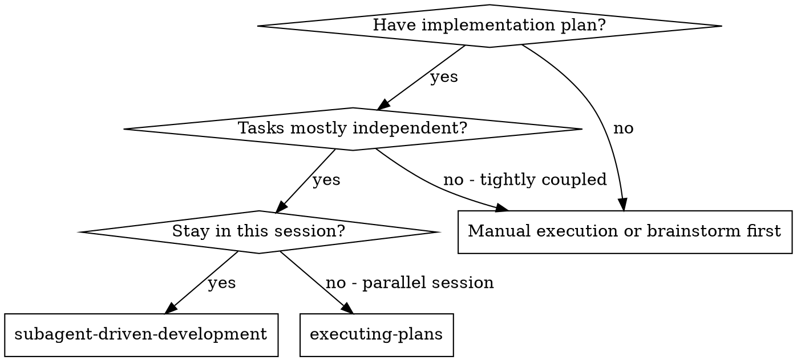
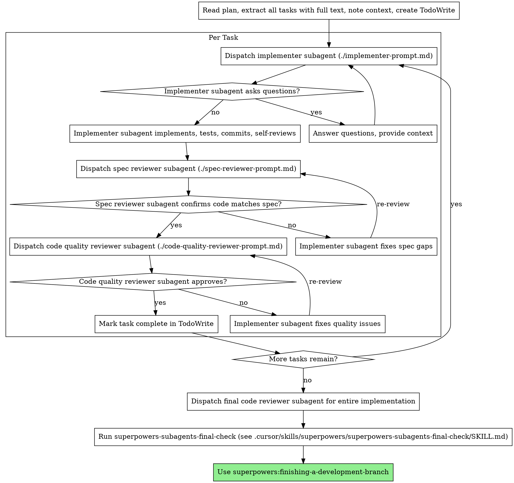

> **Repo copy:** This skill lives at `.cursor/skills/subagent-driven-development/` alongside `implementer-prompt.md`, `spec-reviewer-prompt.md`, and `code-quality-reviewer-prompt.md`. Descended from Cursor Superpowers; edit here for project-specific changes (the IDE plugin cache may differ).

## Repo: documentation placement (Vegan Meal Planner)

When a plan or ticket calls for “tests README”, coverage maps, or testing documentation: **extend [TESTING.md](TESTING.md)** at the repo root. **Do not** add `README.md` under `tests/**` or `src/**` unless the human explicitly requested that file path. Planners and implementers must follow Cursor rule **`documentation-no-ad-hoc-readmes-tests-src.mdc`**.

# Subagent-Driven Development

Execute plan by dispatching fresh subagent per task, with two-stage review after each: spec compliance review first, then code quality review.

**Why subagents:** You delegate tasks to specialized agents with isolated context. By precisely crafting their instructions and context, you ensure they stay focused and succeed at their task. They should never inherit your session's context or history — you construct exactly what they need. This also preserves your own context for coordination work.

**Core principle:** Fresh subagent per task + two-stage review (spec then quality) = high quality, fast iteration

## When to Use



**vs. Executing Plans (parallel session):**
- Same session (no context switch)
- Fresh subagent per task (no context pollution)
- Two-stage review after each task: spec compliance first, then code quality
- Faster iteration (no human-in-loop between tasks)

## The Process



## Model Selection

Use the least powerful model that can handle each role to conserve cost and increase speed.

**Mechanical implementation tasks** (isolated functions, clear specs, 1-2 files): use a fast, cheap model. Most implementation tasks are mechanical when the plan is well-specified.

**Integration and judgment tasks** (multi-file coordination, pattern matching, debugging): use a standard model.

**Architecture, design, and review tasks**: use the most capable available model.

**Task complexity signals:**
- Touches 1-2 files with a complete spec → cheap model
- Touches multiple files with integration concerns → standard model
- Requires design judgment or broad codebase understanding → most capable model

## Handling Implementer Status

Implementer subagents report one of four statuses. Handle each appropriately:

**DONE:** Proceed to spec compliance review.

**DONE_WITH_CONCERNS:** The implementer completed the work but flagged doubts. Read the concerns before proceeding. If the concerns are about correctness or scope, address them before review. If they're observations (e.g., "this file is getting large"), note them and proceed to review.

**NEEDS_CONTEXT:** The implementer needs information that wasn't provided. Provide the missing context and re-dispatch.

**BLOCKED:** The implementer cannot complete the task. Assess the blocker:
1. If it's a context problem, provide more context and re-dispatch with the same model
2. If the task requires more reasoning, re-dispatch with a more capable model
3. If the task is too large, break it into smaller pieces
4. If the plan itself is wrong, escalate to the human

**Never** ignore an escalation or force the same model to retry without changes. If the implementer said it's stuck, something needs to change.

## End of subagent development (required)

Before **superpowers:finishing-a-development-branch** (merge / PR / “done”), the **controller** must **read and follow** **superpowers-subagents-final-check**: [`.cursor/skills/superpowers/superpowers-subagents-final-check/SKILL.md`](../superpowers/superpowers-subagents-final-check/SKILL.md).

That closeout reconciles **all** spec and code-quality reviewer output from the run, applies trivial fixes where appropriate, and **`vom new`s tickets** for useful follow-ups so nothing valuable is only mentioned in chat.

- **If you run** the optional final full-implementation code reviewer, run **superpowers-subagents-final-check** **after** that reviewer, **then** finishing-a-development-branch.
- **If you skip** the final whole-branch reviewer, run **superpowers-subagents-final-check** as soon as the **last task’s** review loops are complete (still before finishing-a-development-branch).

Skipping this step is **not** optional for subagent-driven runs in this repo.

## Capturing code quality review feedback

The **controller** (main session) must not treat “Approved” or “approve with follow-ups” as permission to drop reviewer output. Feedback is only useful if it is **acted on** or **explicitly recorded** before the task is marked complete or the session moves on.

**After each code quality review** (including the optional final full-implementation reviewer), do this before **Mark task complete in TodoWrite** or before claiming the branch done:

| Reviewer severity | Required controller action |
|-------------------|----------------------------|
| **Critical** | Implementer fixes and reviewer re-reviews until resolved. **Do not** complete the task with open Critical items. |
| **Important** | Fix in the current task **or** create a **tracked** follow-up (e.g. VOM ticket, issue tracker, or dated note in the implementation plan). **Do not** silently ignore—either merge the fix into this task or point to where the debt lives. |
| **Minor / suggestion** | Fix if the cost is low; otherwise ensure it is **captured in the end-of-run superpowers-subagents-final-check** (prefer **`vom new`** per that skill). **Do not** treat chat-only “we’ll do it later” as sufficient. |

**Minimum artifact:** Per task, a short note is fine; **before branch closeout**, **superpowers-subagents-final-check** produces the durable closeout: **fixed** / **new ticket (id)** / **skipped (reason)**.

**Pair with:** **superpowers-subagents-final-check** (required end of run) and **superpowers:verification-before-completion** — final checks should include “no unrecorded Important review items” and “no useful Minor/suggestion left only in transcript.”

**Repo verification:** Prefer **`bun run check`** (or `./scripts/check.sh`) for routine passes (format, lint, typecheck, unit tests). Use **`bun run check-all`** / `./scripts/check-all.sh` **only** when integration tests were **updated** or **unit tests alone cannot fully validate** the change—it requires Postgres and is slower.

**Reviewers:** The code-quality reviewer prompt instructs subagents to **create VOM tickets** (or output **VOM ticket drafts**) for **Minor** items and non-blocking **suggestions** — see `code-quality-reviewer-prompt.md`. The spec reviewer prompt does the same for optional, non-blocking observations — see `spec-reviewer-prompt.md`.

## Prompt Templates

Paths are relative to this skill folder (`.cursor/skills/subagent-driven-development/`):

- `./implementer-prompt.md` — Dispatch implementer subagent
- `./spec-reviewer-prompt.md` — Dispatch spec compliance reviewer subagent
- `./code-quality-reviewer-prompt.md` — Dispatch code quality reviewer subagent

## Example Workflow

```
You: I'm using Subagent-Driven Development to execute this plan.

[Read plan file once: docs/superpowers/plans/feature-plan.md]
[Extract all 5 tasks with full text and context]
[Create TodoWrite with all tasks]

Task 1: Hook installation script

[Get Task 1 text and context (already extracted)]
[Dispatch implementation subagent with full task text + context]

Implementer: "Before I begin - should the hook be installed at user or system level?"

You: "User level (~/.config/superpowers/hooks/)"

Implementer: "Got it. Implementing now..."
[Later] Implementer:
  - Implemented install-hook command
  - Added tests, 5/5 passing
  - Self-review: Found I missed --force flag, added it
  - Committed

[Dispatch spec compliance reviewer]
Spec reviewer: ✅ Spec compliant - all requirements met, nothing extra

[Get git SHAs, dispatch code quality reviewer]
Code reviewer: Strengths: Good test coverage, clean. Issues: None. Approved.

[Mark Task 1 complete]

Task 2: Recovery modes

[Get Task 2 text and context (already extracted)]
[Dispatch implementation subagent with full task text + context]

Implementer: [No questions, proceeds]
Implementer:
  - Added verify/repair modes
  - 8/8 tests passing
  - Self-review: All good
  - Committed

[Dispatch spec compliance reviewer]
Spec reviewer: ❌ Issues:
  - Missing: Progress reporting (spec says "report every 100 items")
  - Extra: Added --json flag (not requested)

[Implementer fixes issues]
Implementer: Removed --json flag, added progress reporting

[Spec reviewer reviews again]
Spec reviewer: ✅ Spec compliant now

[Dispatch code quality reviewer]
Code reviewer: Strengths: Solid. Issues (Important): Magic number (100)

[Implementer fixes]
Implementer: Extracted PROGRESS_INTERVAL constant

[Code reviewer reviews again]
Code reviewer: ✅ Approved

[Mark Task 2 complete]

...

[After all tasks]
[Dispatch final code-reviewer]
Final reviewer: All requirements met, ready to merge

[Read and run superpowers-subagents-final-check: reconcile reviewer feedback, vom new for follow-ups, report table]

Done! (then superpowers:finishing-a-development-branch)
```

## Advantages

**vs. Manual execution:**
- Subagents follow TDD naturally
- Fresh context per task (no confusion)
- Parallel-safe (subagents don't interfere)
- Subagent can ask questions (before AND during work)

**vs. Executing Plans:**
- Same session (no handoff)
- Continuous progress (no waiting)
- Review checkpoints automatic

**Efficiency gains:**
- No file reading overhead (controller provides full text)
- Controller curates exactly what context is needed
- Subagent gets complete information upfront
- Questions surfaced before work begins (not after)

**Quality gates:**
- Self-review catches issues before handoff
- Two-stage review: spec compliance, then code quality
- Review loops ensure fixes actually work
- Spec compliance prevents over/under-building
- Code quality ensures implementation is well-built

**Cost:**
- More subagent invocations (implementer + 2 reviewers per task)
- Controller does more prep work (extracting all tasks upfront)
- Review loops add iterations
- But catches issues early (cheaper than debugging later)

## Red Flags

**Never:**
- Start implementation on main/master branch without explicit user consent
- Skip reviews (spec compliance OR code quality)
- Proceed with unfixed issues
- Dispatch multiple implementation subagents in parallel (conflicts)
- Make subagent read plan file (provide full text instead)
- Skip scene-setting context (subagent needs to understand where task fits)
- Ignore subagent questions (answer before letting them proceed)
- Accept "close enough" on spec compliance (spec reviewer found issues = not done)
- Skip review loops (reviewer found issues = implementer fixes = review again)
- Let implementer self-review replace actual review (both are needed)
- **Start code quality review before spec compliance is ✅** (wrong order)
- Move to next task while either review has open issues
- **Drop** code quality feedback: **Important** must be fixed or **explicitly** deferred (ticket / plan note); **Minor** must be fixed or **ticketed** per **Capturing code quality review feedback** and **superpowers-subagents-final-check**—not ignored
- **Skip** **superpowers-subagents-final-check** before **finishing-a-development-branch** after a subagent-driven run

**If subagent asks questions:**
- Answer clearly and completely
- Provide additional context if needed
- Don't rush them into implementation

**If reviewer finds issues:**
- Implementer (same subagent) fixes them
- Reviewer reviews again
- Repeat until approved
- Don't skip the re-review

**If subagent fails task:**
- Dispatch fix subagent with specific instructions
- Don't try to fix manually (context pollution)

## Integration

**Required workflow skills:**
- **superpowers:using-git-worktrees** - REQUIRED: Set up isolated workspace before starting
- **superpowers:writing-plans** - Creates the plan this skill executes
- **superpowers:requesting-code-review** - Code review template for reviewer subagents
- **superpowers-subagents-final-check** (`.cursor/skills/superpowers/superpowers-subagents-final-check/SKILL.md`) - REQUIRED: run after all tasks (and after optional final branch reviewer), **before** **superpowers:finishing-a-development-branch**, to ticket reviewer follow-ups and close review debt
- **superpowers:finishing-a-development-branch** - Complete development after final-check

**Subagents should use:**
- **superpowers:test-driven-development** - Subagents follow TDD for each task

**Alternative workflow:**
- **superpowers:executing-plans** - Use for parallel session instead of same-session execution

**This repo:** Pair with **prisma-delegate-migrate** (`.cursor/skills/prisma-delegate-migrate/SKILL.md`) when a task touches `prisma/schema.prisma` — implementer hands off `bunx prisma migrate dev` to the host.
